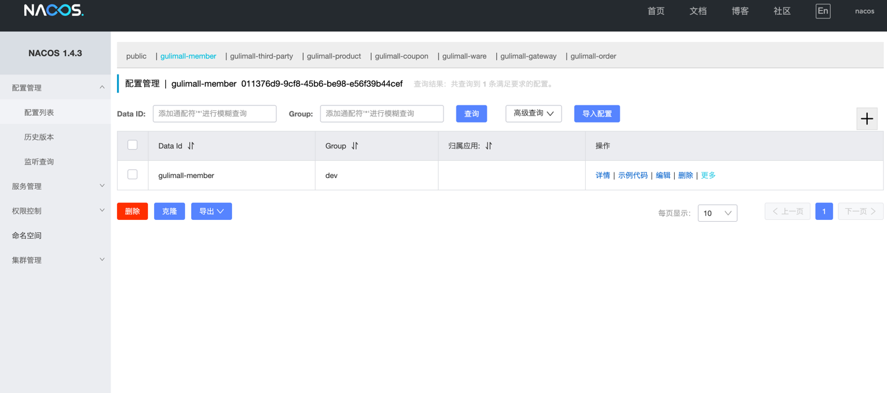

# 谷粒商城

## 介绍
谷粒商城，业务代码完全一样，优化了视频中的pom依赖，更清晰

## 软件架构
软件架构说明


## 安装教程

1.  找到并启动nacos1.4.3，http://localhost:8848/nacos ，账号密码都是 nacos
2.  运行 renren-fast-vue
3.  依次启动 gulimall-gateway，gulimall-product等服务
4.  本系统已删除敏感信息比如阿里云oss的密钥


## 示例



# 开始：依赖版本选择
统一编码 **_UTF-8_**
> .properties文件，统一编码为 ISO-8859-1，springboot底层以此编码加载**_，_**可以在idea设置 以ascii格式显示
> 原因：gulimall-common中的ValidationMessages.properties，若不设置无法显示中文

spring的三个版本，为相对较新的兼容版本，不建议更换
```xml
<lombok.version>1.18.22</lombok.version>
<mysql-connector.version>8.0.17</mysql-connector.version>
<mybatis-plus.version>3.5.0</mybatis-plus.version>
<spring-boot.version>2.3.2.RELEASE</spring-boot.version>
<spring-cloud.version>Hoxton.SR9</spring-cloud.version>
<spring-cloud-alibaba.version>2.2.6.RELEASE</spring-cloud-alibaba.version>
```

- mysql 8.0
- Vue 2
- jdk 8，高版本打包需要额外添加依赖
- nacos 1.4.3
# 1.创建数据库 直接导入sql
| gulimall-oms		 | 订单服务 |
| --- | --- |
| gulimall-pms | 商品服务 |
| gulimall-sms	 | 优惠卷服务 |
| gulimall-ums | 会员服务 |
| gulimall-wms	 | 仓储服务 |
| gulimall-admin	 | 这个是renren-fast的数据库 |

# 2.创建maven模块
| gulimall-common   | com.gulimall.common	 | 公共的工具类 |
| --- | --- | --- |
| gulimall-coupon | com.gulimall.coupon	 | 优惠卷服务 |
| gulimall-gateway | com.gulimall.gateway | 网关	 |
| gulimall-member | com.gulimall.member	 | 会员服务 |
| gulimall-order | com.gulimall.order	 | 订单服务 |
| gulimall-product	 |  com.gulimall.product	 | 商品服务 |
| gulimall-third-party | com.gulimall.thirdparty	 | 第三方服务 |
| gulimall-ware	 | com.gulimall.ware | 仓储服务 |

# 3.改pom
下面代码为父工程pom的必备部分，全局约定了**cloud**和**cloudalibaba**的版本，子项目里无需再写
**重要**的地方为 确定项目的统一 **lombok**，版本不一致将会无法运行，很恶心

| springboot | 2.3.2.RELEASE |
| --- | --- |
| springcloud | Hoxton.SR9 |
| springcloudalibaba | 2.2.6.RELEASE |
| nacos 					 | 1.4.3 |

**官方推荐搭配版本，视频中的版本太老了**

按照这么写就不需要每个项目都写一遍 springcloud版本 ，视频里教的麻烦了
```xml
<?xml version="1.0" encoding="UTF-8"?>
<project xmlns="http://maven.apache.org/POM/4.0.0"
  xmlns:xsi="http://www.w3.org/2001/XMLSchema-instance"
  xsi:schemaLocation="http://maven.apache.org/POM/4.0.0 http://maven.apache.org/xsd/maven-4.0.0.xsd">
  <modelVersion>4.0.0</modelVersion>

  <groupId>com.gulimall</groupId>
  <artifactId>gulimall</artifactId>
  <version>1.0</version>
  <description>父工程，依赖管理</description>
  <packaging>pom</packaging>
  
  <modules>
    <module>gulimall-coupon</module>
    <module>gulimall-member</module>
    <module>gulimall-order</module>
    <module>gulimall-product</module>
    <module>gulimall-ware</module>
    <module>gulimall-common</module>
    <module>gulimall-gateway</module>
    <module>gulimall-third-party</module>
    <module>renren-generator</module>
    <module>renren-fast</module>
  </modules>

  <properties>
    <lombok.version>1.18.22</lombok.version>
    <spring-boot.version>2.3.2.RELEASE</spring-boot.version>
    <spring-cloud.version>Hoxton.SR9</spring-cloud.version>
    <spring-cloud-alibaba.version>2.2.6.RELEASE</spring-cloud-alibaba.version>
  </properties>

  <dependencyManagement>
    <dependencies>
      <dependency>
        <groupId>org.projectlombok</groupId>
        <artifactId>lombok</artifactId>
        <version>${lombok.version}</version>
        <optional>true</optional>
      </dependency>

      <dependency>
        <groupId>org.springframework.boot</groupId>
        <artifactId>spring-boot-dependencies</artifactId>
        <version>${spring-boot.version}</version>
        <type>pom</type>
        <scope>import</scope>
      </dependency>
      <dependency>
        <groupId>org.springframework.cloud</groupId>
        <artifactId>spring-cloud-dependencies</artifactId>
        <version>${spring-cloud.version}</version>
        <type>pom</type>
        <scope>import</scope>
      </dependency>
      <dependency>
        <groupId>com.alibaba.cloud</groupId>
        <artifactId>spring-cloud-alibaba-dependencies</artifactId>
        <version>${spring-cloud-alibaba.version}</version>
        <type>pom</type>
        <scope>import</scope>
      </dependency>
    </dependencies>
  </dependencyManagement>
</project>
```
**示例：子项目pom，部分重要内容**
```xml
<?xml version="1.0" encoding="UTF-8"?>
<project xmlns="http://maven.apache.org/POM/4.0.0"
  xmlns:xsi="http://www.w3.org/2001/XMLSchema-instance"
  xsi:schemaLocation="http://maven.apache.org/POM/4.0.0 http://maven.apache.org/xsd/maven-4.0.0.xsd">
  <parent>
    <artifactId>gulimall</artifactId>
    <groupId>com.gulimall</groupId>
    <version>1.0</version>
  </parent>
  <modelVersion>4.0.0</modelVersion>

  <artifactId>gulimall-product</artifactId>
  <description>商品服务</description>

  <dependencies>
    <dependency>
      <groupId>com.baomidou</groupId>
      <artifactId>mybatis-plus-boot-starter</artifactId>
    </dependency>
    <dependency>
      <groupId>org.springframework.cloud</groupId>
      <artifactId>spring-cloud-starter-openfeign</artifactId>
    </dependency>
  </dependencies>
</project>
```
# 4.引入人人开源的坑

1. renren-fast
2. renren-generator
3. renren-fast-vue

注意：

1. 更改renren-fast的pom中，lombok采用继承父pom的版本，无需填写版本号
2. 删除renren-fast与renren-generator的pom中的**oracle**和**sqlserve**数据库驱动，
3. 删除parent改为继承父项目，父pom提供springboot与其他依赖的版本号

更改模板文件：Controller.java.vm
```java
//更改为 com.gulimall
import com.gulimall.common.utils.PageUtils;
import com.gulimall.common.utils.R;

//删除这类代码 完全没用
@RequiresPermissions

```
# 5.renren-fast的坑：
总结：

1. 采用node15.14
2. 然后执行npm i pubsub-js	，填补缺少的依赖
3. 即可运行

**版本冲突**

根据电脑里的**node**环境修改_ renren-fast-vue _中的 _package.json_
搜索node-sass和sass-loader 进行更改
_renren自带的版本_

- "node-sass": "^6.0.1",
- "sass-loader": "6.0.6",

不作任何修改 ，本人node 16.16及无法运行
更换15.14，完美执行npm install
**npm run dev 出错**
查阅资料发现是webpack新版bug，卸载现有webpack，安装老版本即可
删除node_modules目录，npm cache clean --force  清空缓存

- npm uninstall webpack-dev-server    卸载
- npm install webpack-dev-server@2.9.1   安装
- npm run dev				完成运行
- 执行 npm i pubsub-js		因为官方没有这个依赖，代码里用到了

人人开源全是坑
# 6.mac版本nacos的坑
系统自带jdk路径，后来单独安装jdk8
自带路径包含空格，nacos执行**空格路径**的命令导致出错，无法开启，手动在系统环境变量中添加
export  JAVA_HOME=/Library/Java/JavaVirtualMachines/jdk1.8.0_341.jdk/Contents/Home
# 7.可以看视频了


# 1.renren-fast和网关
目的：添加跨域     注册到nacos
renren-fast需要添加 **nacos**依赖
renre的原本boot版本为2.6、
如果 nacos依赖版本和 springboot保持一致，就要继承父pom，删掉原有的springboot parent，
同时 renren跨域的java配置也要修改

- 不修改：无法登陆，验证码正常
- 视频说注释掉：无法登陆，验证码不显示
- 删了配置的java文件：一切正常
# 2.validator校验bug
**不影响**后续全局拦截异常的校验异常，因为不需要返回默认的报错信息
**bug**：接口返回，不显示 message和错误信息
可能的方法一：添加如下，返回多出message字段，但是没内容
```xml
<dependency>
  <groupId>org.hibernate</groupId>
  <artifactId>hibernate-validator</artifactId>
  <version>6.1.0.Final</version>
</dependency>
```
可能的方法二:
```xml
<dependency>
  <groupId>org.springframework.boot</groupId>
  <artifactId>spring-boot-starter-validation</artifactId>
</dependency>
<dependency>
  <groupId>org.hibernate</groupId>
  <artifactId>hibernate-validator</artifactId>
  <version>6.1.0.Final</version>
</dependency>
```
成功的方法三:
yml中添加
```yaml
server:
  port: 8080
  error:
    include-binding-errors: always
    include-message: always
```
# 3.vue项目设置的修改
注释掉，esLint代码检查

更改请求url为网关

# 4.至此项目不会有阻碍运行的bug，看视频到validator校验信息


